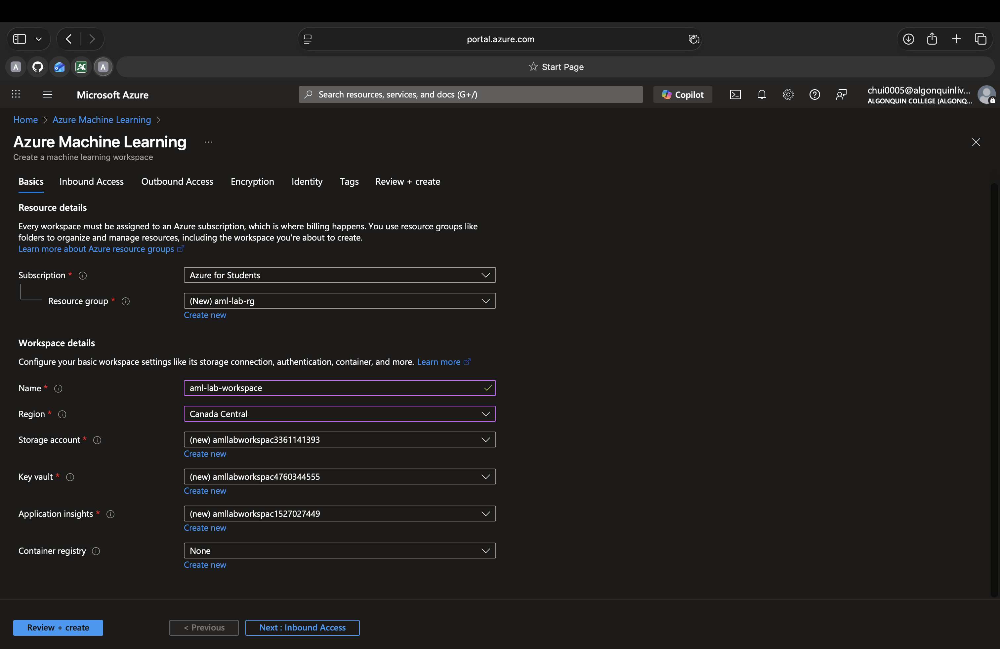
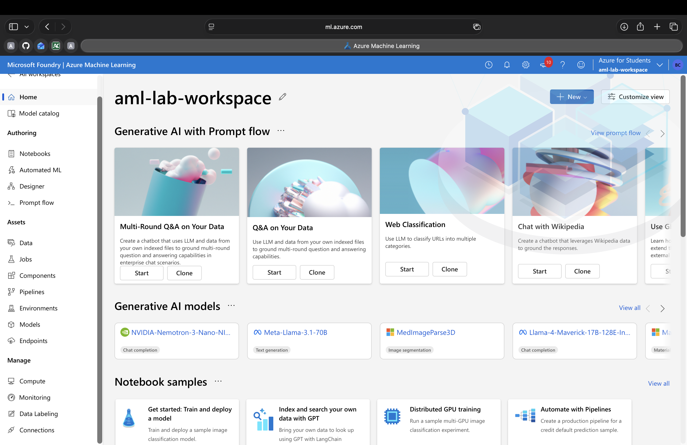
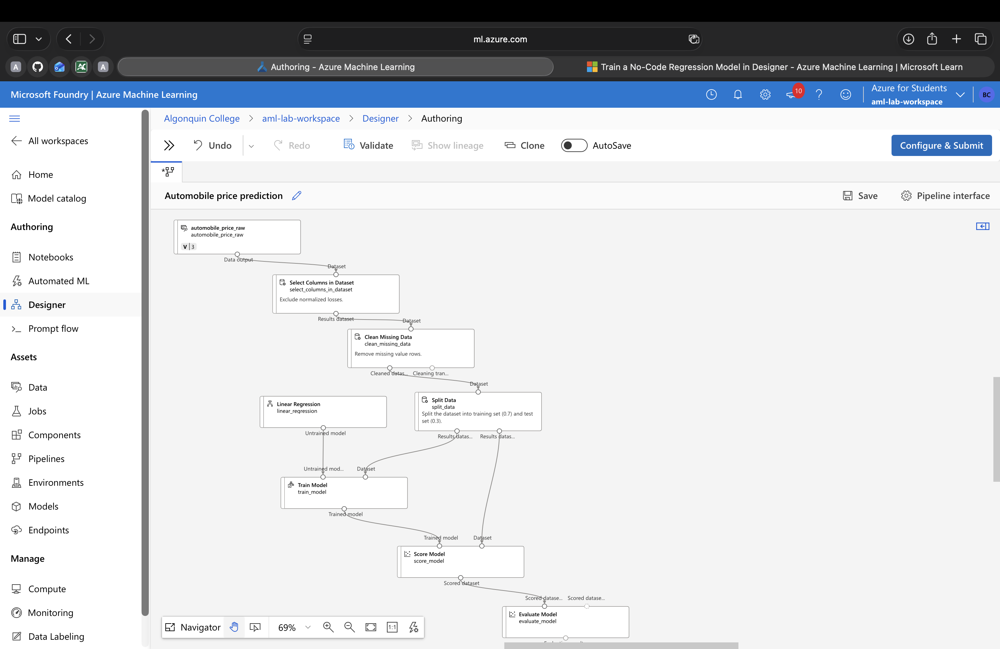
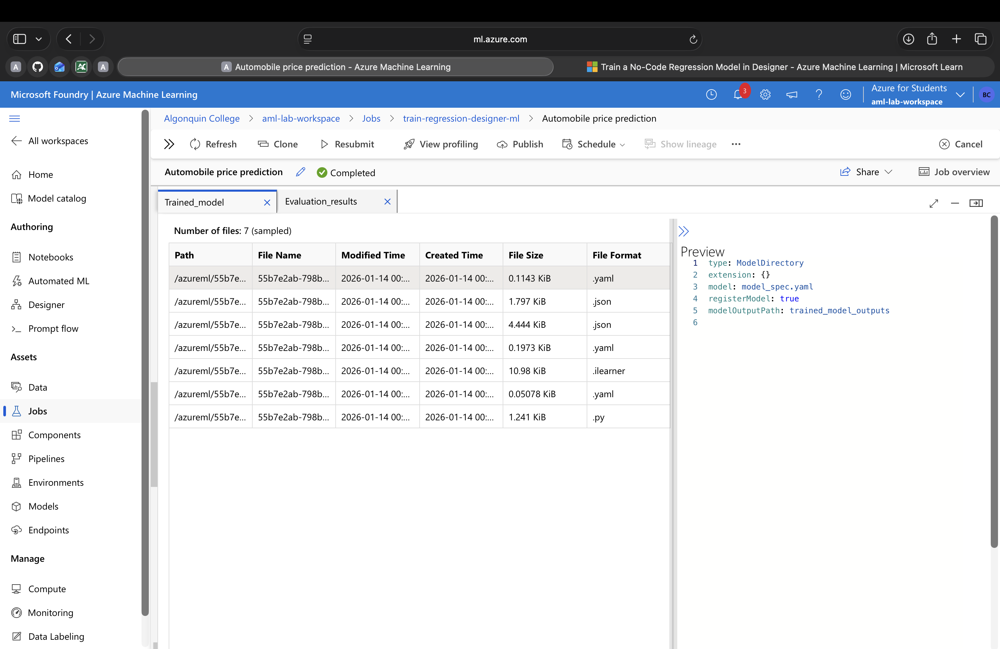
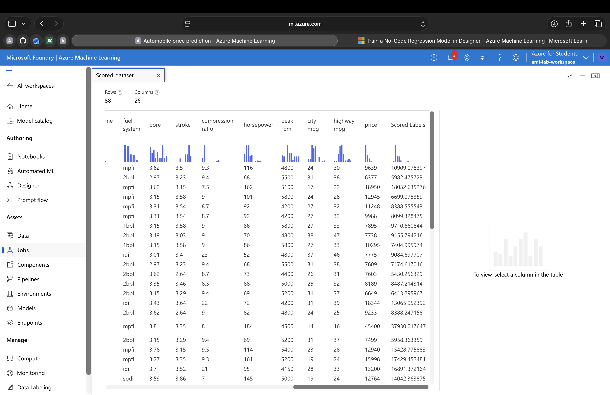
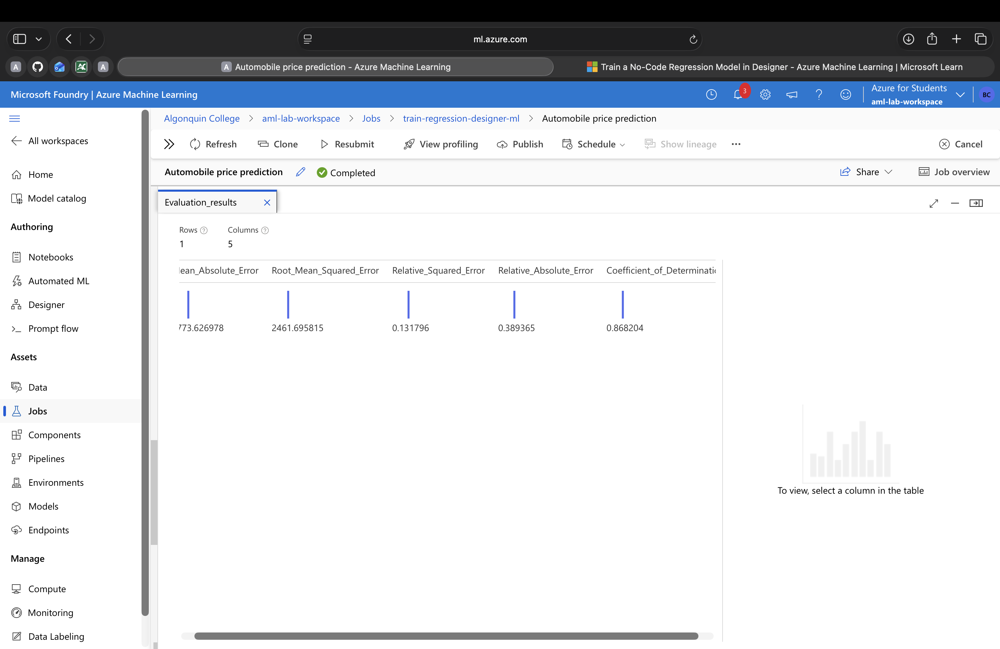
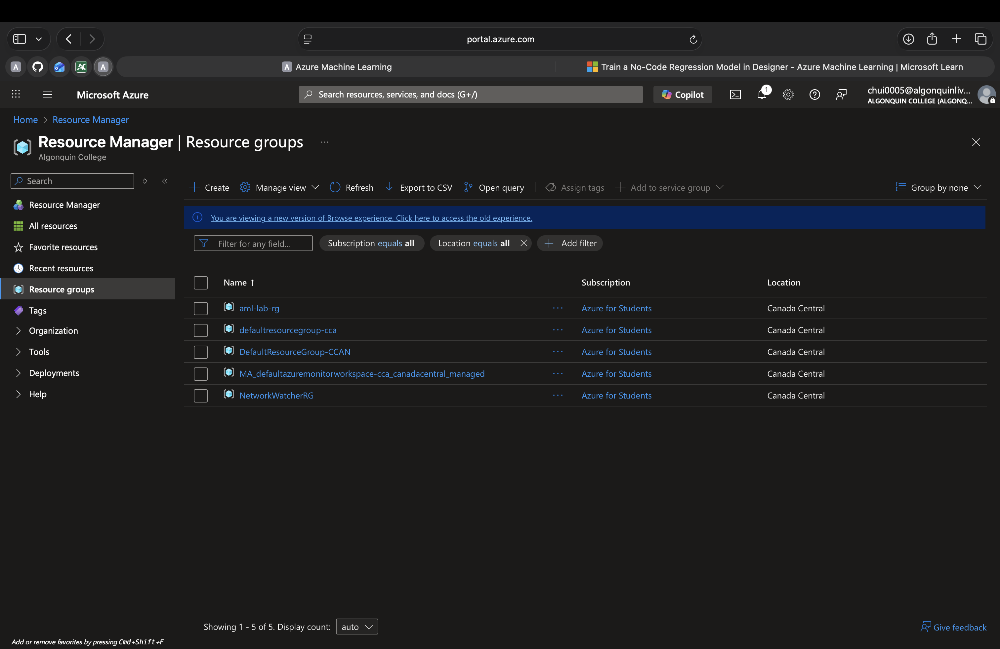
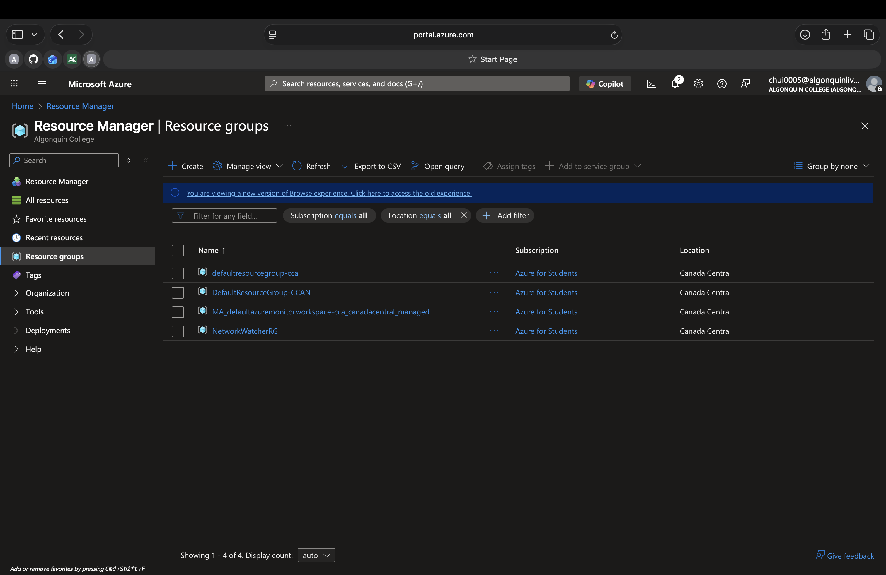

# CST8921– Cloud Industry Trends
## Lab 1 – AI and ML
## Bryan Chuinkam - 040811108

### Task 1: Create Azure ML worspace
- Created and familairized myslef with the interface. 

### Task 2: Explore Azure ML studio
- This is a web-based portal that caan be accessed through Azure ML workspace. 
    - The sections of note here are the: 
    1) Authoring: ways to create ML Models
    2) Assets: Objects used or produced during ML workflows 
    3) Manage: Infrastructure resources. 

### Task 3 - 12: Creating a training pipline
- This [Azure training module](https://learn.microsoft.com/en-us/azure/machine-learning/tutorial-designer-automobile-price-train-score?view=azureml-api-1
) was followed to Train a no-code regression model using designer. 

### Task 13: Explore pipeline and understand output

- In this tutorial a linear regression model was trained that learnt the relationship between features of each automobile and the price. 
- The model looked at examples from the training dataset and found the **best-fitting** linear relationship between the car characteristics and the price. 

- The scored dataset below comes from the **Score Model** component in the pipeline. It shows the **predicted prices** (Scored Label). 
- We can visually compare predicted VS actual prices to see how well the model did. 

- In the Evalution Results below, we see the summary stats from the **Evaluation Model** which quantifies how well the model did. 
The columns shown are: 

| Metric | What It Means | 
|--------|---------------|
|Mean Absolute Error (MAE)|Average absolute difference between the predicted and actual prices (smaller is better)|
|Root Mean Squared Error (RMSE)|Like MAE but penalizes larger errors more. Useful for overall fit|
|Relative Squared Error / Relative Absolute Error|compare errors relative to a simple baseline (like predicting the average price).|
|Coefficient of Determination |How much of the price variation the model explains|

### Task 14: Clean up resources

- Resources Before 

- Resources After
