# CST8921– Cloud Industry Trends
## Lab 2 – Cloud Security trends
## Bryan Chuinkam - 040811108

### Task 1: Create an Azure Policy
- The purpose of this taak is to practice establishing security by ensuring resources can only be deployed in an approved region.

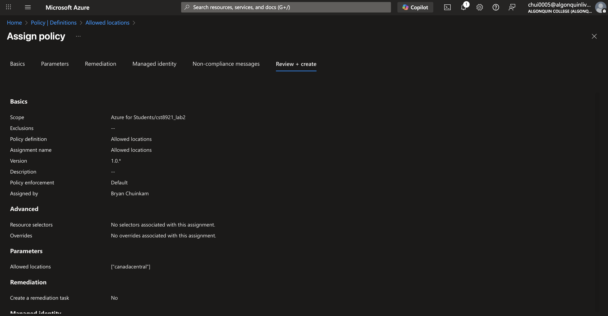

- Below is a screenshot validating the policy was properly setup by trying to create a resource outisde of the designated location

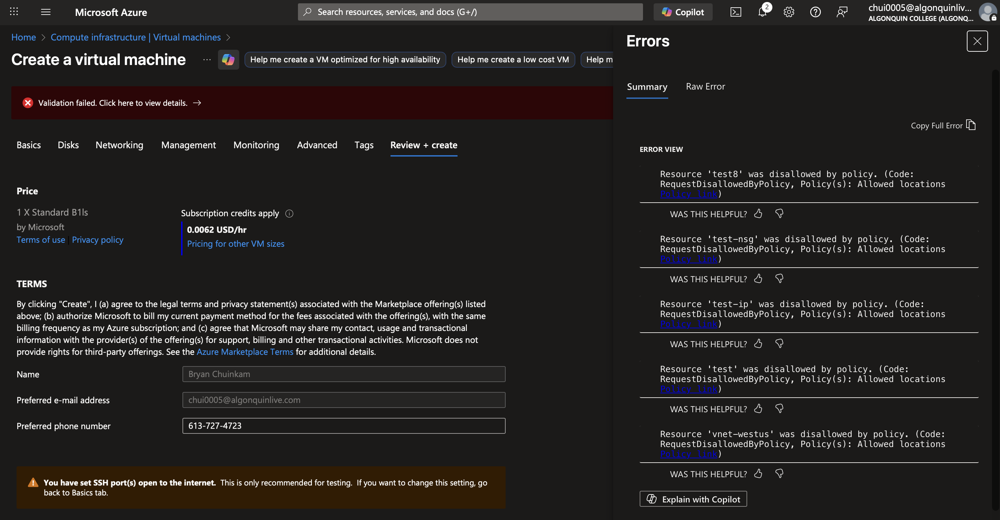

### Task 2: Create a Virtual Network
- Now we are establishing a secure network boundary by creating a Virtual Network within the region allowed in our policy. 

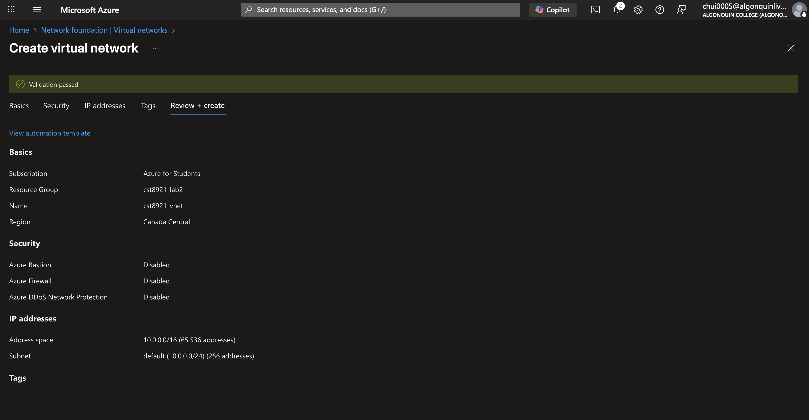

### Task 3: Create Subnets & Enable Storage Service Endpoint
- The purpose of this task is to ensure storage traffic stays within Azure’s backbone network.
So we created two subnets one public and one private (with Microsoft storage as an accessible service)

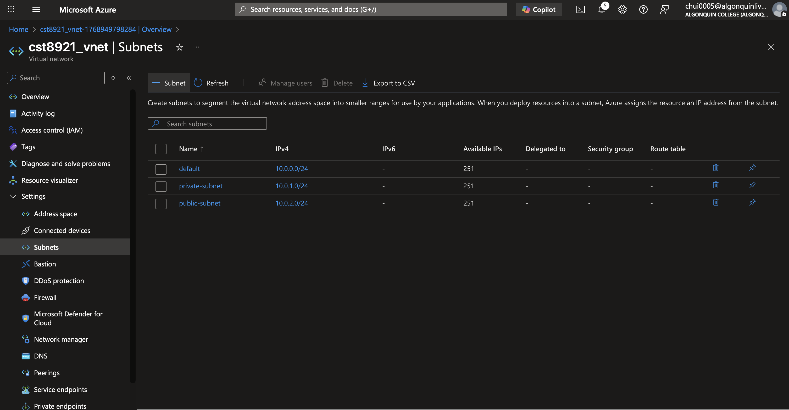

### Task 4: Create Network Security Group (NSG)
- Purpose of this task is to use NSG to control inbound and outbound traffic. 

We first create the NSG

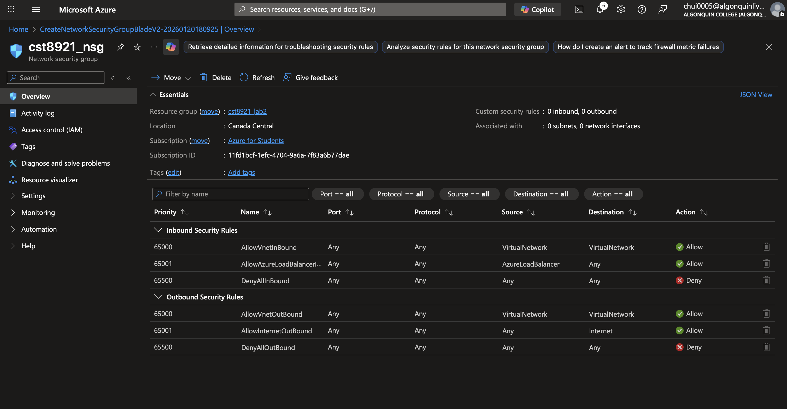

Then we link it to the appropriate subnet.

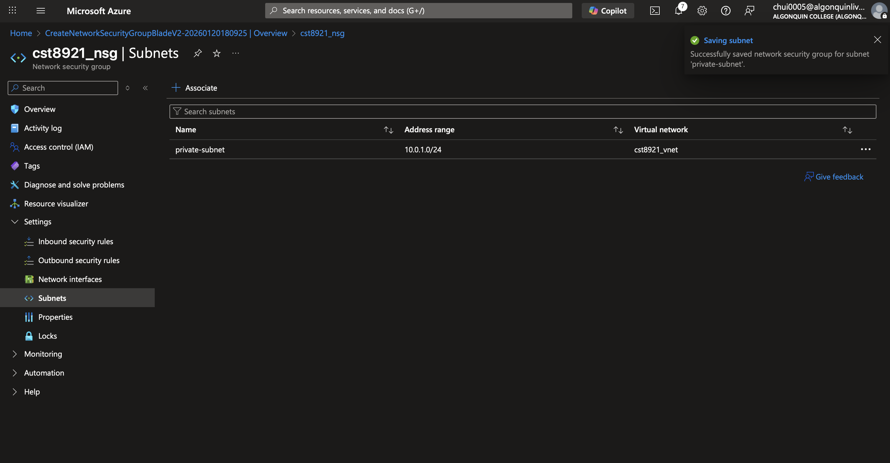

### Task 5: Configure NSG Rules (Private Subnet)
- Created two outbound traffic rules. 

1) Allowing traffic to Azure Storage 
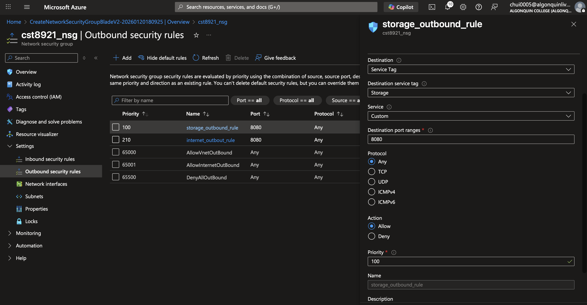

2) Blocking traffic to the internet 
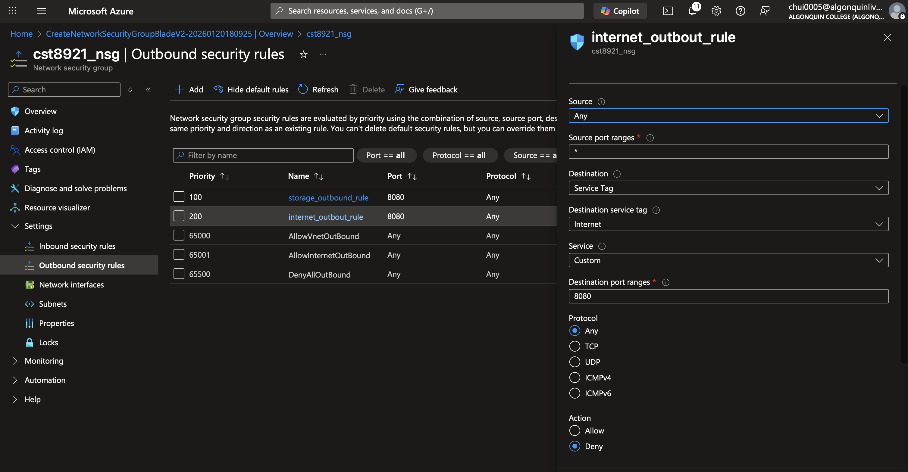

### Task 6: Configure NSG for Public Subnet (RDP Access)
- First we create a NSG for the public subnet. Then we set the inbound rule to allow RDP. 

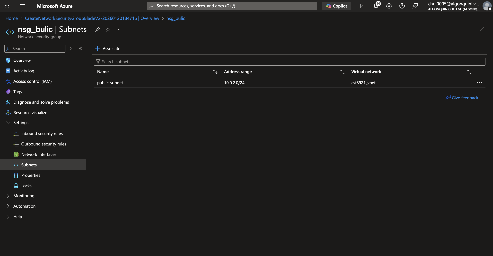

- Then we set the inbound rule allowing RDP

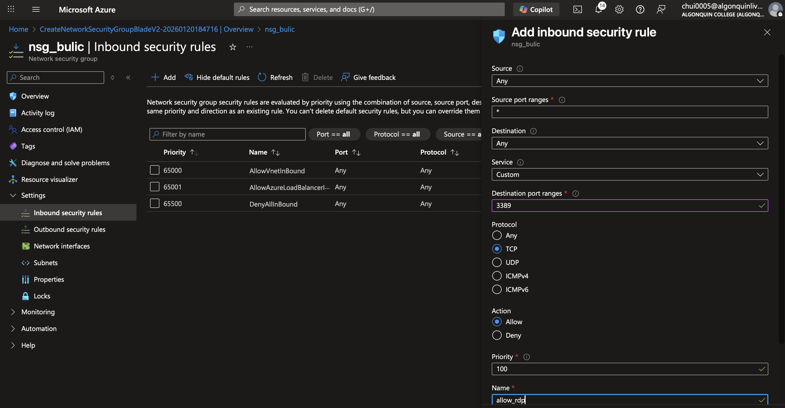

### Task 7: Create a Storage Account with File Share
- Secure storage account only accessible from the **private subnet**. With Azure File Share
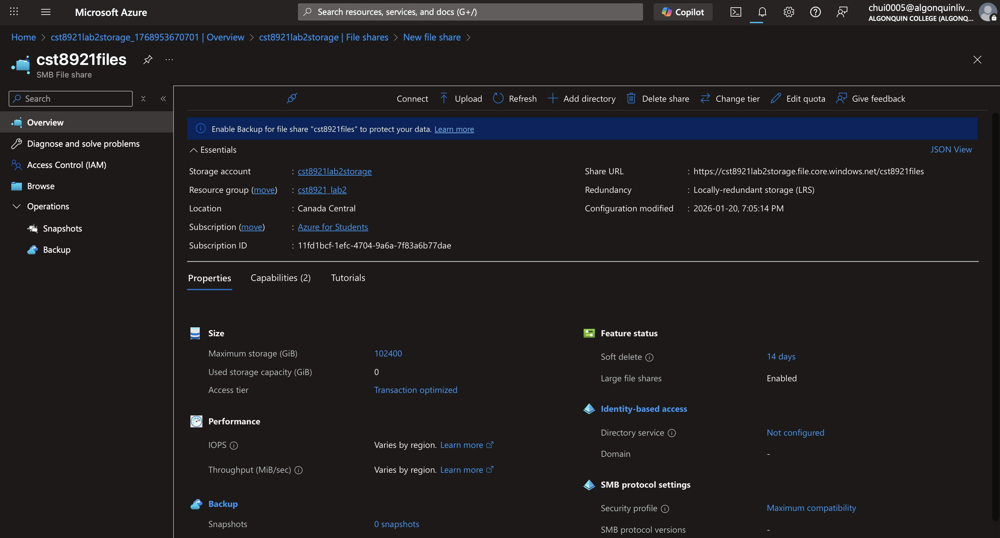

### Task 8: Deploy Virtual Machines
- Deploy two Windows VMs

 - Private VM
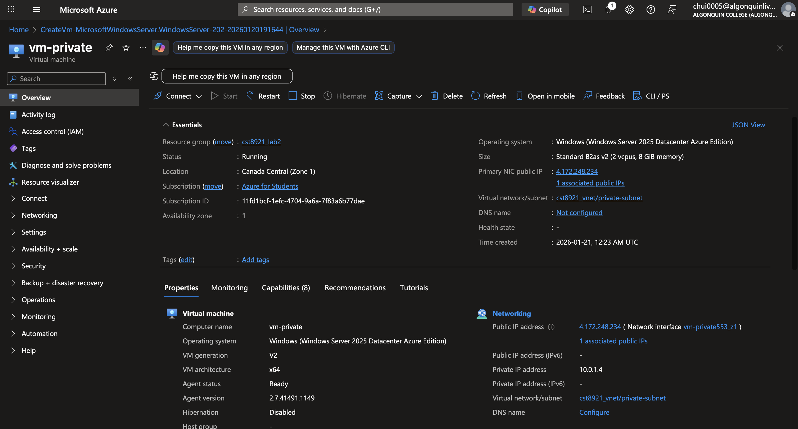

- Public VM
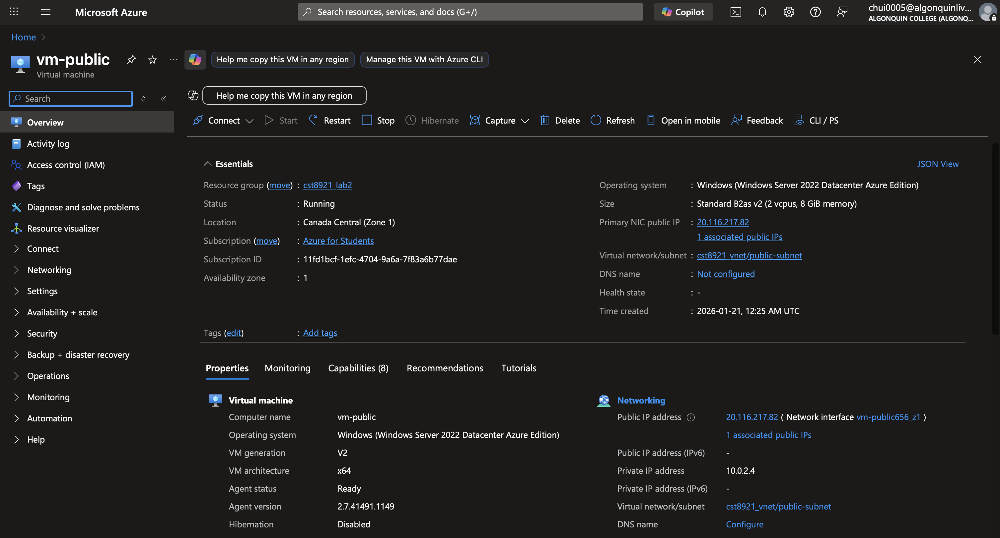

### Task 9: Test Storage Access from Private Subnet (Allowed)
- Connected to the vm-private using the Bastion then tried accessing the file share. 
This was successful.

 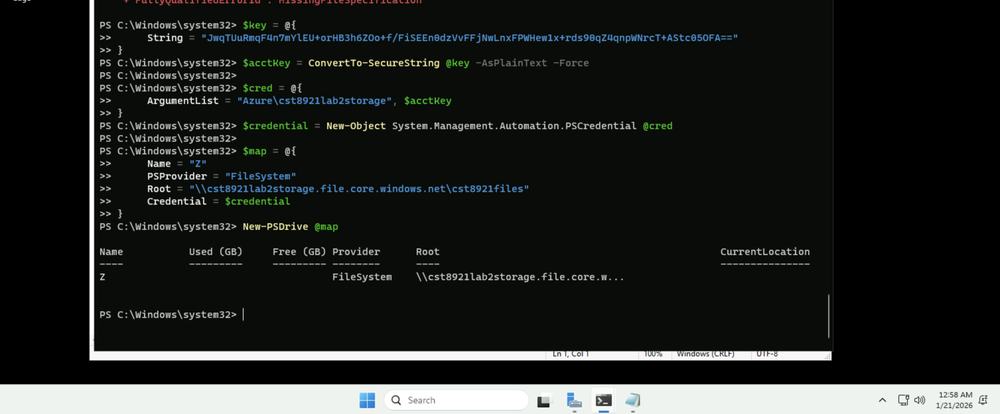

### Task 10: Test Storage Access from Public Subnet (Denied)
- Try connecting to the the file share from the vm-public using the Bastion. It failed 
 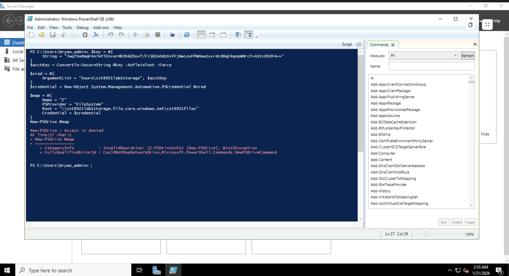

###  Cleanup (Mandatory)
- Before
 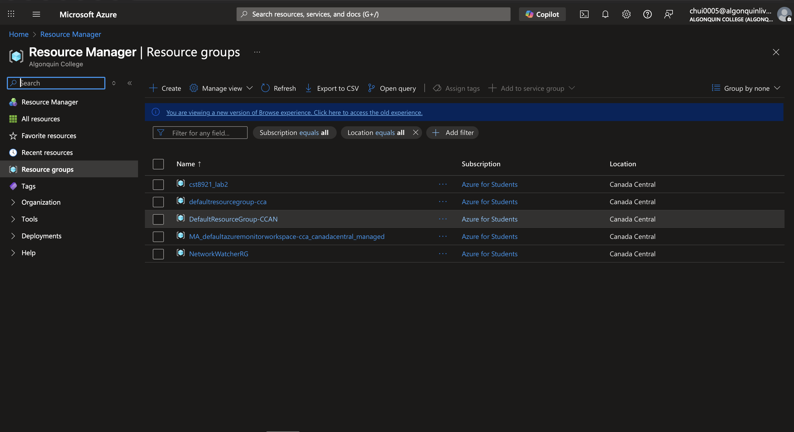

- After
 
